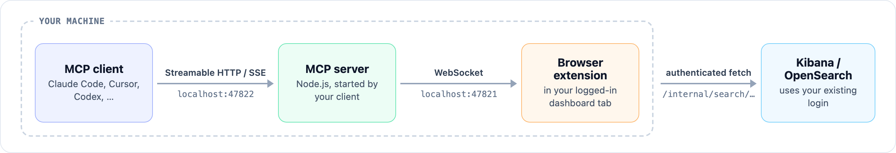

# Kibana Bridge MCP

**Search Kibana / OpenSearch Dashboards logs from AI assistants through your authenticated browser session. No API keys, no service accounts.**

Most log platforms behind corporate SSO don't hand out API tokens. This project sidesteps that entirely: a small Chrome extension executes searches inside your already-logged-in dashboard tab, and an MCP server exposes the results as tools to Claude Code, Claude Desktop, Cursor, or any other MCP client.



Works with **OpenSearch Dashboards** (including SAP BTP Cloud Logging) and **Kibana**, and the extension auto-detects which flavor it's talking to.

## Why not just use the Elasticsearch API?

You often can't. Managed log platforms (SAP BTP Cloud Logging, corporate Kibana behind SSO/SAML, etc.) frequently expose *only* the dashboard UI. Your browser session is the one credential you reliably have. This bridge reuses it, with the same permissions you already have as a user, and nothing leaves your machine.

## Tools

| Tool | What it does |
|---|---|
| `summarize_logs` | Cheap overview: total hits, time histogram, top values per dimension. Start here. |
| `available_log_fields` | Samples matching docs and lists every populated field path to learn the schema. |
| `search_logs` | Full search with include/exclude filters, boolean AND, custom display fields. |
| `get_log_context` | Everything that happened ±N seconds around a timestamp ("view surrounding documents"). |
| `inspect_log` | `_source` of one log entry as YAML. Trimmed by default (duplicate raw `log` dropped, 5 stack frames, annotations collapsed); pass `full: true` for everything. |

The tool descriptions teach the AI an investigation workflow (summarize wide → identify noise → exclude → narrow), so it explores logs the way an experienced engineer does. Results are aggressively compacted (grouped duplicate lines, YAML-ified JSON payloads, access-log one-liners) to keep token usage low.

Every tool also accepts:

- **`environment`**: which configured dashboard to search (`prod`, `stage`, …). Configure multiple environments in the extension popup; the extension reports their names to the server so the AI knows what's available. Omitted → the first configured environment.
- **`query_dsl`** (except `inspect_log`): a raw OpenSearch/Elasticsearch query DSL clause AND-ed into the search, for anything plain text can't express: `{range: {status: {gte: 500}}}`, wildcards, OR logic, exists checks.
- **`level`** (except `inspect_log`): filter on the level field (`LEVEL_FIELD`), e.g. `'ERROR'` or `['ERROR','WARN']`. More precise than putting `ERROR` in `query`.
- **`match`** on any `include_filters` / `exclude_filters` item: `"phrase"` (default, match_phrase) or `"wildcard"` (case-insensitive, `*` and `?`), e.g. `{field: 'logs.contextMap.CronJob', value: '*wIndex*', match: 'wildcard'}`.

`get_log_context` also takes **`trace_id`**, which scopes the window to one trace via `TRACE_ID_FIELD`.

`query` is matched against the `QUERY_FIELDS` list; an empty string or `*` matches everything. Time windows are resolved to absolute UTC bounds and every response header shows them (e.g. `2026-09-23T10:28:00.000Z → 2026-09-23T10:40:00.000Z (last 15 min)`). A search with 0 hits and filters gets a debug helper showing the top values each filtered field actually has in the unfiltered set.

`available_log_fields` additionally queries the dashboard's field-caps API, so the field list comes back typed (`text`, `keyword`, `date`, …) with aggregatability flags, so the AI knows exactly which fields work in `aggregate_fields` without trial and error.

## Installation

Four steps, about two minutes. Using Claude Code, Codex or another agent with a terminal? [Let it do the install](#let-your-ai-assistant-install-it). It only needs you for a few browser clicks.

### 1. Connect your MCP client (the client runs the server for you)

**Claude Code:**

```bash
claude mcp add kibana-logs -- npx -y kibana-bridge-mcp@latest
```

**Claude Desktop / Cursor / other clients**: add to your MCP config:

```json
{
  "mcpServers": {
    "kibana-logs": {
      "command": "npx",
      "args": ["-y", "kibana-bridge-mcp@latest"]
    }
  }
}
```

**Other CLIs:**

```bash
codex mcp add kibana-logs -- npx -y kibana-bridge-mcp@latest                              # OpenAI Codex
gemini mcp add kibana-logs npx kibana-bridge-mcp@latest                                   # Gemini CLI
code --add-mcp '{"name":"kibana-logs","command":"npx","args":["-y","kibana-bridge-mcp@latest"]}'  # VS Code
```

Config file locations: Claude Desktop `~/Library/Application Support/Claude/claude_desktop_config.json` (macOS) or `%APPDATA%\Claude\claude_desktop_config.json` (Windows); Cursor `~/.cursor/mcp.json`.

**Windows:** many clients spawn the command without a shell and can't find `npx` (it's `npx.cmd`), so wrap it in `cmd /c`: `claude mcp add kibana-logs -- cmd /c npx -y kibana-bridge-mcp@latest`, or in JSON `"command": "cmd", "args": ["/c", "npx", "-y", "kibana-bridge-mcp@latest"]`.

That's it: no terminal to keep open, no process to manage. The client spawns the server on demand, and if several MCP clients each spawn one, the extra instances detect the running one and transparently proxy to it, so they all share a single browser bridge. `@latest` makes npx check npm for a new release on each launch, so the server keeps itself up to date. If the extension falls behind, the AI tells you to re-run `install-extension`.

<details>
<summary>Prefer a standalone long-running server?</summary>

Run `npx -y kibana-bridge-mcp@latest` in a terminal (or `npm run pm2:start` from a clone) and point clients at it over HTTP instead:

```bash
claude mcp add --transport http kibana-logs http://localhost:47822/mcp
```

Clients that only support the legacy SSE transport can use `http://localhost:47822/sse`.
</details>

### 2. Install the Chrome extension

The extension works in any Chromium browser (Chrome, Edge, Brave, Arc, Vivaldi, Opera, …) but not Firefox or Safari. It isn't on the Chrome Web Store yet, so load it unpacked (30 seconds). First copy it to a stable folder:

```bash
npx -y kibana-bridge-mcp@latest install-extension
```

This puts it in `~/.kibana-bridge/extension`, copies that path to your clipboard, and opens your default browser's extensions page (`chrome://extensions`, `edge://extensions`, `brave://extensions`, …), falling back to Chrome. Pick a different browser with `--browser chrome|brave|edge|arc|vivaldi|opera|chromium`. Then:

1. Toggle **Developer mode** (top right; left sidebar in Edge).

   

2. Click **Load unpacked** and select the folder. Paste the path with ⌘⇧G on macOS, or into the dialog's address bar on Windows.

   

3. **Kibana Log Bridge** now appears in the list:

   

Load it in one browser only (the one where you're logged into your dashboard), since every copy would compete for the same local server.

To update later, re-run the command and click the reload ↻ icon on **Kibana Log Bridge** in the extensions page.

### 3. Add your dashboard (one click)

Open your Kibana / OpenSearch Dashboards site and log in, then click the extension icon and hit **➕ Add this dashboard** (the button only appears on Kibana / OpenSearch Dashboards pages). The extension grabs the URL from the tab, asks Chrome for access to that site (the permission prompt may close the popup, but the dashboard is still added), names the environment after the dashboard's own title/logo, and auto-detects your index patterns from the dashboard itself (picking its default). Repeat on other dashboards (stage, dev, …). Each becomes a named environment the AI selects per search via the `environment` parameter.

Once a dashboard is configured, a small pill appears in its header (`d1-prod · AI connected`) so you can tell at a glance whether the AI can reach that tab and whether the MCP server is running. While the AI works, the pill shows the live search (`searching "OrderService timeout"…` → `1,204 hits`), so you can follow the investigation from the dashboard itself.

The gear icon opens manual settings if you ever need to rename an environment, change its index pattern, or tweak ports.

### 4. Try it

Ask your assistant something like:

> Summarize the errors in our logs over the last 24 hours, then dig into the most common one.

The bridge self-heals around the common snags: if no dashboard tab is open it opens one in the background and retries; if you're redirected to a login page or your session has expired it focuses the tab and tells the AI to ask you to log in; and if your logs keep their text under an unusual field it auto-detects a display field from the results.

## Let your AI assistant install it

Paste this into Claude Code, Codex, Cursor or any agent with a terminal:

> Install kibana-bridge-mcp for me by following the "For AI agents" steps in https://github.com/yunusemregul/kibana-mcp#for-ai-agents

### For AI agents

Steps 1–2 are commands you can run; the rest are browser clicks only the user can do, because Chrome doesn't let scripts or extensions toggle Developer mode, load unpacked extensions, or grant site access. Do them in order:

1. Register the MCP server with the client you're running in (see [step 1](#1-connect-your-mcp-client-the-client-runs-the-server-for-you); use the `cmd /c` form on Windows). Node.js 18+ is required. Check with `node --version`.
2. Run `npx -y kibana-bridge-mcp@latest install-extension`. It prints the folder path, copies it to the clipboard and opens the browser's extensions page. Add `--no-open` to skip opening the browser, `--browser <name>` to pick one.
3. Ask the user to: turn on **Developer mode**, click **Load unpacked**, and paste the printed path. Wait for them to confirm.
4. Ask the user to open their Kibana / OpenSearch Dashboards site, log in, click the **Kibana Log Bridge** toolbar icon (under the puzzle-piece menu if it isn't pinned) and press **➕ Add this dashboard**, allowing site access when asked.
5. Tell the user to restart the MCP client (or reconnect MCP servers, e.g. `/mcp` in Claude Code) so the new tools load.
6. Verify: `curl -s http://localhost:47822/health` should show `"extension":{"connected":true,…,"environments":["<name>"]}`. `connected:false` means the extension isn't loaded or enabled; an empty `environments` list means step 4 wasn't done. If the endpoint doesn't answer, the MCP client hasn't started the server yet. Then call `summarize_logs` with a broad query to confirm searches work.

## Configuration

> **You can skip this section.** The defaults work for most setups, and the extension popup covers everything you normally need. These settings are for advanced users who want to tune the server to an unusual log schema or change ports.

**Server** (environment variables):

| Variable | Default | Purpose |
|---|---|---|
| `MCP_PORT` | `47822` | HTTP port for the MCP endpoints |
| `WS_PORT` | `47821` | WebSocket port the extension connects to |
| `HOST` | `127.0.0.1` | Bind address for both servers (loopback only by default) |
| `DISPLAY_FIELDS` | `message,logs.message,msg,log,logs.request,logs.requestFirstLine` | Default fallback chain of field paths used to render each hit (when the chain misses, a display field is auto-detected from the results anyway) |
| `SUMMARY_FIELDS` | `logs.level,logs.loggerName,logs.thrown.name,kubernetes.pod_name` | Default dimensions bucketed by `summarize_logs` |
| `QUERY_FIELDS` | `message,logs.message,msg,log,logs.loggerName,logs.thread,logs.thrown.name,logs.thrown.message,logs.request,logs.requestFirstLine` | Fields the `query` text is matched against. Set to an empty string to use the index's default fields |
| `LEVEL_FIELD` | `logs.level` | Field the `level` parameter filters on |
| `TRACE_ID_FIELD` | `logs.contextMap.traceId` | Field the `get_log_context` `trace_id` parameter filters on |
| `FIELDS_STRATIFY_FIELD` | `kubernetes.container_name` | `available_log_fields` samples docs across this field's values so rare container types still show their fields |
| `SOURCE_TAG_FIELDS` | `kubernetes.labels.ccv2_cx_sap_com_platform-aspect,kubernetes.container_name` | First non-empty value becomes the `[api]`-style source tag prefixed to each hit |

Tune `DISPLAY_FIELDS` / `SUMMARY_FIELDS` / `QUERY_FIELDS` to your log schema for the best out-of-the-box results, or just let the AI discover fields per-investigation via `available_log_fields`.

**Extension** (popup settings):

| Setting | Default | Purpose |
|---|---|---|
| Environments | None | One or more named dashboards, each with its own URL and index pattern. The first one is the default. At least one is required. |
| WebSocket port | `47821` | Must match the server's `WS_PORT` |

## Troubleshooting

| Symptom | Fix |
|---|---|
| Tool errors with "No active browser extension connected" | Chrome isn't running, the extension isn't loaded, or the badge shows OFF. Check `chrome://extensions` and that the server is up. |
| "…redirected to a login page" | The bridge opened your dashboard but SSO bounced it. Log in in the tab it opened, then retry. |
| "No environments configured" | Open your dashboard, click the extension icon, and hit ➕ Add this dashboard. |
| "Unknown environment …" | The AI passed an environment name that doesn't match your popup config. The error lists the valid names. |
| "Port 47821 (or 47822) is in use by another program" | Every tool call returns this until it is fixed. Free the port (`lsof -ti:47821 \| xargs kill`; on Windows `netstat -ano \| findstr :47821`, then `taskkill /PID <pid> /F`) or set `WS_PORT` / `MCP_PORT` in the MCP config env (and update the port in the extension popup), then reconnect the MCP server. |
| Searches return `HTTP Error: 401/403` | Your dashboard session expired. Reload the tab and log in again. |
| Results show empty messages | Your logs keep their text under a different field. Ask the AI to call `available_log_fields`, or set `DISPLAY_FIELDS`. |
| Extension badge stuck OFF | The MCP server isn't running, or the WebSocket port in the popup doesn't match `WS_PORT`. |

## Security notes

- Everything runs on `localhost`. Queries and results never leave your machine (other than going to your dashboard, where they'd go anyway).
- The WebSocket server rejects connections from web pages (any `http(s)` origin); only browser-extension origins and local tools may connect.
- The extension only gets access to the dashboard origin you explicitly grant in the popup, and performs read-only `_search` requests with your existing session, so it can't do anything you can't already do in the UI.
- The MCP HTTP endpoints are unauthenticated on localhost. Don't expose port 47822 to a network you don't trust.

## License

[MIT](LICENSE)
