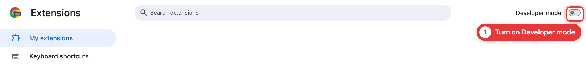
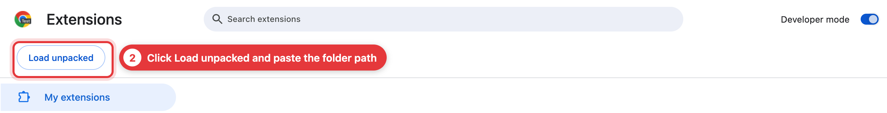
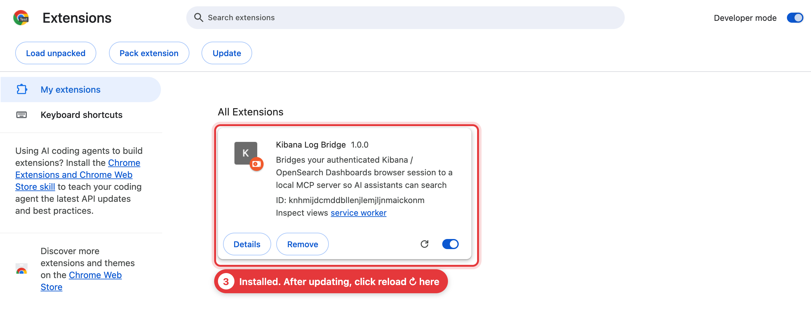

# Kibana Bridge MCP

[](https://www.npmjs.com/package/kibana-bridge-mcp) [](https://github.com/yunusemregul/kibana-mcp/actions/workflows/ci.yml) [](https://nodejs.org) [](LICENSE)

**English** | [Türkçe](README.tr.md)

**Let your AI assistant search Kibana / OpenSearch Dashboards logs through your logged-in browser tab. No API keys, no service accounts.**


Log platforms behind corporate SSO rarely hand out API tokens. Your browser session is the one credential you always have, so a small extension runs the searches inside your dashboard tab and an MCP server hands the results to Claude Code, Cursor, Codex or any other MCP client.


Works with **Kibana** and **OpenSearch Dashboards** (including SAP BTP Cloud Logging).

## Setup

Takes about two minutes. Using an AI agent with a terminal? [Let it do the setup](#let-your-ai-do-the-setup).

### 1. Add it to your AI client

```bash
claude mcp add --scope user kibana-logs -- npx -y kibana-bridge-mcp@latest
```

`--scope user` makes it available in all your projects (leave it out to add it to the current project only). Your client starts the server by itself whenever it needs it, and `@latest` keeps it up to date.

<details>
<summary>Cursor, Claude Desktop, Codex, Gemini CLI, VS Code, Windows</summary>

JSON config (Claude Desktop, Cursor and most other clients):

```json
{
  "mcpServers": {
    "kibana-logs": {
      "command": "npx",
      "args": ["-y", "kibana-bridge-mcp@latest"]
    }
  }
}
```

Config files: Claude Desktop `~/Library/Application Support/Claude/claude_desktop_config.json` (macOS) or `%APPDATA%\Claude\claude_desktop_config.json` (Windows). Cursor `~/.cursor/mcp.json`.

```bash
codex mcp add kibana-logs -- npx -y kibana-bridge-mcp@latest
gemini mcp add kibana-logs npx kibana-bridge-mcp@latest
code --add-mcp '{"name":"kibana-logs","command":"npx","args":["-y","kibana-bridge-mcp@latest"]}'
```

**Windows:** many clients can't find `npx` on their own, so run it through `cmd /c`. For example `claude mcp add --scope user kibana-logs -- cmd /c npx -y kibana-bridge-mcp@latest`, or `"command": "cmd", "args": ["/c", "npx", "-y", "kibana-bridge-mcp@latest"]` in JSON.

**Standalone server:** run `npx -y kibana-bridge-mcp@latest` in a terminal and connect clients to `http://localhost:47822/mcp` (or `/sse` for older clients).
</details>

### 2. Install the browser extension

```bash
npx -y kibana-bridge-mcp@latest install-extension
```

This copies the extension folder path to your clipboard and opens your browser's extensions page. There, turn on **Developer mode**, click **Load unpacked** and paste the path.

Works in Chrome, Edge, Brave, Arc, Vivaldi and Opera. Install it in the browser you use for your dashboard.

<details open>
<summary>Show me with screenshots</summary>





In Edge, Developer mode is in the left sidebar. In the folder picker, press ⌘⇧G on macOS or use the address bar on Windows to paste the path. Add `--browser brave` (or `chrome`, `edge`, …) to the command to pick a browser other than your default, or `--lang tr|en` to set the output language.
</details>

### 3. Add your dashboard

Open your Kibana / OpenSearch Dashboards site, log in, click the extension icon and press **➕ Add this dashboard**. The name and index pattern are detected for you. Repeat for other environments (stage, prod, …).

A small pill then appears in the dashboard header showing whether the AI is connected, and what it's searching for while it works.

### 4. Try it

> Summarize the errors in our logs over the last 24 hours, then dig into the most common one.

### Updating

The server updates by itself. When the extension is out of date, the AI tells you: re-run the `install-extension` command, then click reload ↻ on **Kibana Log Bridge** in the extensions page.

## Let your AI do the setup

Paste this into Claude Code, Codex, Cursor or any agent with a terminal:

> Set up kibana-bridge-mcp for me by following https://github.com/yunusemregul/kibana-mcp#for-ai-agents

### For AI agents

You can run steps 1 and 2. The browser steps need the user, because browsers don't let scripts enable Developer mode, load extensions or grant site access.

1. Check `node --version` is 18 or newer, then register the server with the client you're running in ([commands](#1-add-it-to-your-ai-client); use the `cmd /c` form on Windows).
2. Run `npx -y kibana-bridge-mcp@latest install-extension`. It prints the folder path (`--no-open` skips opening the browser, `--browser <name>` picks one).
3. Ask the user to turn on **Developer mode**, click **Load unpacked** and paste that path. Wait for them to confirm.
4. Ask the user to open their dashboard, log in, click the **Kibana Log Bridge** icon (in the puzzle-piece menu if not pinned) and press **➕ Add this dashboard**.
5. Ask the user to restart the client or reconnect MCP servers (`/mcp` in Claude Code) so the tools load.
6. Verify with `curl -s http://localhost:47822/health`. You want `"connected":true` and at least one name in `"environments"`. No answer means the client hasn't started the server yet. Finish with a broad `summarize_logs` call.

## Tools

| Tool | What it does |
|---|---|
| `summarize_logs` | Cheap overview: hit count, time histogram, top values per field. Start here. |
| `available_log_fields` | Lists every field in matching docs, with types. Learns the schema. |
| `search_logs` | Full search with include/exclude filters and custom display fields. |
| `get_log_context` | Everything around a timestamp, optionally limited to one trace. |
| `inspect_log` | One log entry in full, as YAML. |

The tools teach the AI to investigate like an engineer (summarize wide, find the noise, exclude it, narrow down), and results are compacted to keep token usage low.

<details>
<summary>Common parameters</summary>

- **`environment`**: which configured dashboard to search. Defaults to the first one.
- **`level`**: filter by log level, e.g. `'ERROR'` or `['ERROR','WARN']`.
- **`query_dsl`**: a raw OpenSearch / Elasticsearch query clause for anything plain text can't express, e.g. `{range: {status: {gte: 500}}}`.
- **`match: "wildcard"`** on an include/exclude filter for `*` and `?` patterns.
- **`trace_id`** on `get_log_context` to follow one trace.
- **`full: true`** on `inspect_log` to skip trimming of long stack traces and annotations.
</details>

## Troubleshooting

| Problem | Fix |
|---|---|
| "No active browser extension connected" | Check the extension is loaded and enabled, and that your AI client is running. |
| "Redirected to a login page" / HTTP 401 or 403 | Your dashboard session expired. Log in again in that tab and retry. |
| "No environments configured" | Open your dashboard and press ➕ Add this dashboard in the extension. |
| "Port 47821 (or 47822) is in use" | Another program has the port. Free it or set `WS_PORT` / `MCP_PORT` (see below). |
| Results show empty messages | Your logs use a different text field. Ask the AI to run `available_log_fields`. |

## Configuration

You don't need this for normal use. It's for tuning the server to an unusual log schema or changing ports.

<details>
<summary>Environment variables</summary>

Set these in the `env` block of your MCP client config.

| Variable | Default | Purpose |
|---|---|---|
| `MCP_PORT` | `47822` | HTTP port for MCP clients |
| `WS_PORT` | `47821` | WebSocket port for the extension (also change it in the extension settings) |
| `HOST` | `127.0.0.1` | Bind address |
| `DISPLAY_FIELDS` | `message,logs.message,msg,log,logs.request,logs.requestFirstLine` | Fields used as each hit's message text, in order |
| `SUMMARY_FIELDS` | `logs.level,logs.loggerName,logs.thrown.name,kubernetes.pod_name` | Default fields `summarize_logs` counts |
| `QUERY_FIELDS` | `message,logs.message,msg,log,logs.loggerName,logs.thread,logs.thrown.name,logs.thrown.message,logs.request,logs.requestFirstLine` | Fields searched by `query`. Empty means the index defaults |
| `LEVEL_FIELD` | `logs.level` | Field `level` filters on |
| `TRACE_ID_FIELD` | `logs.contextMap.traceId` | Field `trace_id` filters on |
| `FIELDS_STRATIFY_FIELD` | `kubernetes.container_name` | `available_log_fields` samples across this field's values |
| `SOURCE_TAG_FIELDS` | `kubernetes.labels.ccv2_cx_sap_com_platform-aspect,kubernetes.container_name` | Source tag shown before each hit |

Freeing a port: `lsof -ti:47821 | xargs kill` on macOS / Linux, or `netstat -ano | findstr :47821` then `taskkill /PID <pid> /F` on Windows.
</details>

## Security

- Everything runs on your machine. Searches go only to your own dashboard, using your existing session and permissions.
- The extension only accesses dashboards you add, and only reads.
- The local server rejects connections from web pages. Its MCP port has no authentication, so don't expose port 47822 to other machines.

## License

[MIT](LICENSE)
