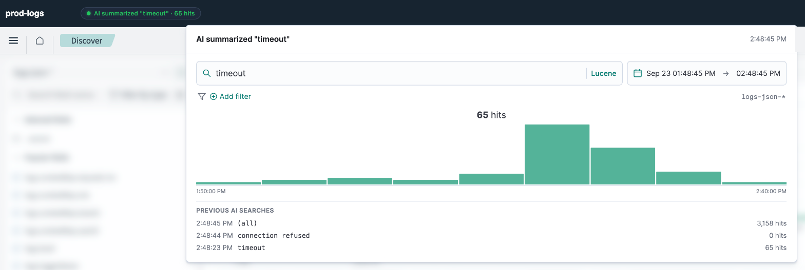
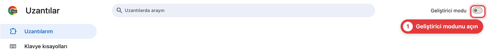
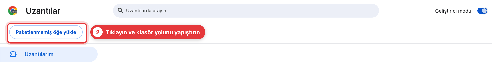
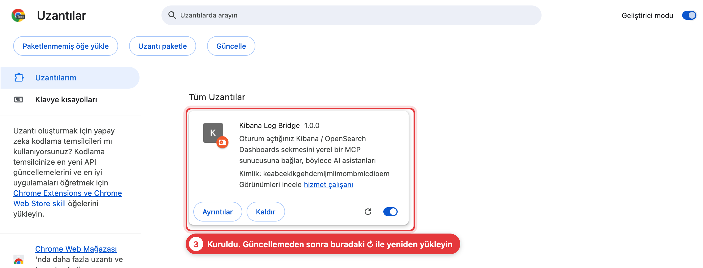

# Kibana Bridge MCP

[English](README.md) | **Türkçe**

**AI asistanınız Kibana / OpenSearch Dashboards loglarını, giriş yaptığınız tarayıcı sekmesi üzerinden arasın. API anahtarı yok, servis hesabı yok.**



Kurumsal SSO arkasındaki log platformları nadiren API token verir. Tarayıcı oturumunuz ise elinizde her zaman olan tek kimlik bilgisidir. Küçük bir uzantı aramaları dashboard sekmenizin içinde çalıştırır, MCP sunucusu da sonuçları Claude Code, Cursor, Codex veya başka bir MCP istemcisine iletir.


**Kibana** ve **OpenSearch Dashboards** ile çalışır (SAP BTP Cloud Logging dahil).

## Kurulum

Yaklaşık iki dakika sürer. Terminali olan bir AI ajanı mı kullanıyorsunuz? [Kurulumu ona bırakın](#kurulumu-ai-yapsın).

### 1. AI istemcinize ekleyin

```bash
claude mcp add kibana-logs -- npx -y kibana-bridge-mcp@latest
```

İstemciniz sunucuya ihtiyaç duyduğunda onu kendisi başlatır. `@latest` sayesinde de hep güncel kalır.

<details>
<summary>Cursor, Claude Desktop, Codex, Gemini CLI, VS Code, Windows</summary>

JSON yapılandırması (Claude Desktop, Cursor ve diğer çoğu istemci):

```json
{
  "mcpServers": {
    "kibana-logs": {
      "command": "npx",
      "args": ["-y", "kibana-bridge-mcp@latest"]
    }
  }
}
```

Yapılandırma dosyaları: Claude Desktop için `~/Library/Application Support/Claude/claude_desktop_config.json` (macOS) veya `%APPDATA%\Claude\claude_desktop_config.json` (Windows). Cursor için `~/.cursor/mcp.json`.

```bash
codex mcp add kibana-logs -- npx -y kibana-bridge-mcp@latest
gemini mcp add kibana-logs npx kibana-bridge-mcp@latest
code --add-mcp '{"name":"kibana-logs","command":"npx","args":["-y","kibana-bridge-mcp@latest"]}'
```

**Windows:** birçok istemci `npx`'i kendi başına bulamaz, bu yüzden `cmd /c` üzerinden çalıştırın. Örneğin `claude mcp add kibana-logs -- cmd /c npx -y kibana-bridge-mcp@latest` ya da JSON'da `"command": "cmd", "args": ["/c", "npx", "-y", "kibana-bridge-mcp@latest"]`.

**Bağımsız sunucu:** terminalde `npx -y kibana-bridge-mcp@latest` çalıştırın ve istemcileri `http://localhost:47822/mcp` adresine bağlayın (eski istemciler için `/sse`).
</details>

### 2. Tarayıcı uzantısını kurun

```bash
npx -y kibana-bridge-mcp@latest install-extension
```

Bu komut uzantı klasörünün yolunu panoya kopyalar ve tarayıcınızın Uzantılar sayfasını açar. Orada **Geliştirici modu** seçeneğini açın, **Paketlenmemiş öğe yükle** düğmesine tıklayın ve yolu yapıştırın.

Chrome, Edge, Brave, Arc, Vivaldi ve Opera'da çalışır. Dashboard'unuzu hangi tarayıcıda kullanıyorsanız oraya kurun.

<details open>
<summary>Ekran görüntüleriyle göster</summary>





Edge'de Geliştirici modu sol kenar çubuğundadır. Klasör seçicide yolu yapıştırmak için macOS'ta ⌘⇧G tuşlarına basın, Windows'ta adres çubuğunu kullanın. Varsayılan tarayıcınız dışında birini seçmek için komuta `--browser brave` (veya `chrome`, `edge`, …) ekleyin. Çıktı dilini `--lang tr|en` ile belirleyebilirsiniz.
</details>

### 3. Dashboard'unuzu ekleyin

Kibana / OpenSearch Dashboards sitenizi açıp giriş yapın, uzantı simgesine tıklayın ve **➕ Bu dashboard'u ekle** düğmesine basın. Ad ve indeks deseni otomatik algılanır. Diğer ortamlar (stage, prod, …) için de aynısını yapın.

Ardından dashboard'un üst kısmında küçük bir etiket belirir. AI'ın bağlı olup olmadığını ve çalışırken ne aradığını gösterir.

### 4. Deneyin

> Son 24 saatteki loglarımızda yer alan hataları özetle, sonra en sık görüleni detaylı incele.

### Güncelleme

Sunucu kendini günceller. Uzantı eskidiğinde AI size haber verir: `install-extension` komutunu yeniden çalıştırın, ardından Uzantılar sayfasında **Kibana Log Bridge** üzerindeki yeniden yükle ↻ simgesine tıklayın.

## Kurulumu AI yapsın

Bunu Claude Code, Codex, Cursor veya terminali olan herhangi bir ajana yapıştırın:

> https://github.com/yunusemregul/kibana-mcp/blob/main/README.tr.md#for-ai-agents adresindeki adımları izleyerek kibana-bridge-mcp'yi benim için kur.

<a id="for-ai-agents"></a>
### AI ajanları için

Adım 1 ve 2'yi sen çalıştırabilirsin. Tarayıcı adımları kullanıcıyı gerektirir, çünkü tarayıcılar betiklerin Geliştirici modunu açmasına, uzantı yüklemesine veya site erişimi vermesine izin vermez.

1. `node --version` değerinin 18 veya üzeri olduğunu kontrol et, ardından sunucuyu içinde çalıştığın istemciye kaydet ([komutlar](#1-ai-istemcinize-ekleyin); Windows'ta `cmd /c` biçimini kullan).
2. `npx -y kibana-bridge-mcp@latest install-extension` komutunu çalıştır. Klasör yolunu yazdırır (`--no-open` tarayıcıyı açmaz, `--browser <ad>` tarayıcı seçer).
3. Kullanıcıdan **Geliştirici modu** seçeneğini açmasını, **Paketlenmemiş öğe yükle** düğmesine tıklamasını ve o yolu yapıştırmasını iste. Onaylamasını bekle.
4. Kullanıcıdan dashboard'unu açıp giriş yapmasını, **Kibana Log Bridge** simgesine tıklamasını (sabitlenmemişse yapboz parçası menüsündedir) ve **➕ Bu dashboard'u ekle** düğmesine basmasını iste.
5. Araçların yüklenmesi için kullanıcıdan istemciyi yeniden başlatmasını veya MCP sunucularına yeniden bağlanmasını iste (Claude Code'da `/mcp`).
6. `curl -s http://localhost:47822/health` ile doğrula. `"connected":true` ve `"environments"` içinde en az bir ad görmelisin. Yanıt yoksa istemci sunucuyu henüz başlatmamıştır. Son olarak geniş kapsamlı bir `summarize_logs` çağrısı yap.

## Araçlar

| Araç | Ne yapar |
|---|---|
| `summarize_logs` | Hafif genel bakış: kayıt sayısı, zaman histogramı, alan başına en sık değerler. Buradan başlayın. |
| `available_log_fields` | Eşleşen kayıtlardaki tüm alanları tipleriyle listeler. Şemayı öğrenir. |
| `search_logs` | Dahil etme / hariç tutma filtreleri ve özel gösterim alanlarıyla tam arama. |
| `get_log_context` | Bir zaman damgası etrafındaki her şey, istenirse tek bir trace ile sınırlı. |
| `inspect_log` | Tek bir log kaydının tamamı, YAML olarak. |

Araçlar AI'a bir mühendis gibi araştırmayı öğretir (geniş özetle, gürültüyü bul, onu hariç tut, daralt). Token kullanımını düşük tutmak için sonuçlar sıkıştırılır.

<details>
<summary>Sık kullanılan parametreler</summary>

- **`environment`**: hangi yapılandırılmış dashboard'da aranacağı. Varsayılan ilk dashboard'dur.
- **`level`**: log seviyesine göre filtre, ör. `'ERROR'` veya `['ERROR','WARN']`.
- **`query_dsl`**: düz metinle ifade edilemeyen her şey için ham bir OpenSearch / Elasticsearch sorgu ifadesi, ör. `{range: {status: {gte: 500}}}`.
- **`match: "wildcard"`**: `*` ve `?` desenleri için, bir dahil etme / hariç tutma filtresinde.
- **`trace_id`**: `get_log_context` içinde tek bir trace'i takip etmek için.
- **`full: true`**: `inspect_log` içinde uzun stack trace ve açıklamaların kırpılmaması için.
</details>

## Sorun giderme

| Sorun | Çözüm |
|---|---|
| "No active browser extension connected" | Uzantının yüklü ve etkin olduğunu, AI istemcinizin çalıştığını kontrol edin. |
| "Redirected to a login page" / HTTP 401 veya 403 | Dashboard oturumunuzun süresi dolmuş. O sekmede tekrar giriş yapıp yeniden deneyin. |
| "No environments configured" | Dashboard'unuzu açın ve uzantıda ➕ Bu dashboard'u ekle düğmesine basın. |
| "Port 47821 (or 47822) is in use" | Portu başka bir program kullanıyor. Portu boşaltın veya `WS_PORT` / `MCP_PORT` ayarlayın (aşağıya bakın). |
| Sonuçlarda mesajlar boş görünüyor | Loglarınız farklı bir metin alanı kullanıyor. AI'dan `available_log_fields` çalıştırmasını isteyin. |

## Yapılandırma

Normal kullanımda buna ihtiyacınız yok. Sunucuyu alışılmadık bir log şemasına göre ayarlamak veya portları değiştirmek için.

<details>
<summary>Ortam değişkenleri</summary>

Bunları MCP istemci yapılandırmanızın `env` bloğunda ayarlayın.

| Değişken | Varsayılan | Amaç |
|---|---|---|
| `MCP_PORT` | `47822` | MCP istemcileri için HTTP portu |
| `WS_PORT` | `47821` | Uzantı için WebSocket portu (uzantı ayarlarında da değiştirin) |
| `HOST` | `127.0.0.1` | Dinlenecek adres |
| `DISPLAY_FIELDS` | `message,logs.message,msg,log,logs.request,logs.requestFirstLine` | Her kaydın mesaj metni olarak kullanılan alanlar, sırasıyla |
| `SUMMARY_FIELDS` | `logs.level,logs.loggerName,logs.thrown.name,kubernetes.pod_name` | `summarize_logs`'un varsayılan olarak saydığı alanlar |
| `QUERY_FIELDS` | `message,logs.message,msg,log,logs.loggerName,logs.thread,logs.thrown.name,logs.thrown.message,logs.request,logs.requestFirstLine` | `query` ile aranan alanlar. Boş bırakılırsa index varsayılanları kullanılır |
| `LEVEL_FIELD` | `logs.level` | `level` filtresinin uygulandığı alan |
| `TRACE_ID_FIELD` | `logs.contextMap.traceId` | `trace_id` filtresinin uygulandığı alan |
| `FIELDS_STRATIFY_FIELD` | `kubernetes.container_name` | `available_log_fields` bu alanın değerleri arasından örnek alır |
| `SOURCE_TAG_FIELDS` | `kubernetes.labels.ccv2_cx_sap_com_platform-aspect,kubernetes.container_name` | Her kaydın önünde gösterilen kaynak etiketi |

Port boşaltma: macOS / Linux'ta `lsof -ti:47821 | xargs kill`, Windows'ta `netstat -ano | findstr :47821` ardından `taskkill /PID <pid> /F`.
</details>

## Güvenlik

- Her şey sizin bilgisayarınızda çalışır. Aramalar yalnızca kendi dashboard'unuza, mevcut oturumunuz ve yetkilerinizle gider.
- Uzantı yalnızca eklediğiniz dashboard'lara erişir ve yalnızca okur.
- Yerel sunucu web sayfalarından gelen bağlantıları reddeder. MCP portunda kimlik doğrulama yoktur, bu yüzden 47822 portunu başka makinelere açmayın.

## Lisans

[MIT](LICENSE)
